

  

 

  <h1>🌟 기프티콘 중고거래 플랫폼 ConSeller 🌟</h1>

## "기프티콘을 쉽고 안전하게 거래하세요!"

ConSeller는 기프티콘 중고거래 플랫폼은 빠르게 성장하는 기프티콘 시장에 새로운 해결책을 제시합니다.  
더 이상 사용하지 않는 기프티콘을 현금화하거나, 다양한 기프티콘을 할인된 가격에 구매할 수 있는 플랫폼입니다.

### 💡 주요 특징 💡

`투명한 거래` : 판매자의 계좌 정보를 명확히 보여줌으로써 투명한 거래를 보장합니다.  
`간편한 기프티콘 등록` : 사용자는 OCR 기능을 통해 간편하게 기프티콘을 등록할 수 있습니다. 
`손쉬운 기프티콘 관리` : 기프티콘의 유효기간에 따라 알림을 발송하고 기프티콘이 만료되면 자동으로 만료처리가 됩니다. 
`다양한 거래 방식` : 경매, 물물교환, 구매/판매 방식 중 원하는 방식으로 거래가 가능합니다. 
`쉽고 빠른 거래` : 간편한 사용자 인터페이스와 직관적인 거래 과정을 통해 누구나 쉽게 기프티콘을 거래할 수 있습니다.

 

## 👪 개발 멤버 소개

<table> <tr> <td height="140px" align="center"> <a href="https://github.com/Kno-youn-sik">     👑 노윤식  (Front-End) </a>  </td> <td height="140px" align="center"> <a href="https://github.com/veblen1"> 
    😆 박해종  (Front-End) </a>  </td> <td height="140px" align="center"> <a href="https://github.com/footdev">     😶 김현수  (Back-End) </a>  </td> <td height="140px" align="center"> <a href="https://github.com/daehwa-park">     🙄 박대화  (Back-End) </a>  </td> <td height="140px" align="center"> <a href="https://github.com/Park-Jaehyeon98">     😁 박재현  (Back-End) </a>  </td> <td height="140px" align="center"> <a href="https://github.com/kingofthigh">     🙂 정의민  (Back-End) </a>  </td> </tr>
 </table>
 

## 📆 프로젝트 기간

### 23.08.21. ~ 23.10.06

 

## 💡 서비스 소개

### ConSeller

> OCR을 활용한 간편한 기프티콘 등록

> 판매, 경매, 물물교환 다양한 거래 방식

> 마이페이지를 통한 통합 기프티콘 관리

> Firebase를 이용한 알림 기능

## 🛠 개발 환경 🛠

| FrontEnd                  | BackEnd           | DB           | CI/CD                  | 협업툴 | 기타            |
| ------------------------- | ----------------- | ------------ | ---------------------- | ------ | --------------- |
| Kotlin(1.8.10)            | JAVA JDK 11       | MySQL 8.0.33 | AWS EC2 (Ubuntu 20.04) | GitLab | Postman 10.15.8 |
| Jetpack Compose(23.03.00) | SpringBoot 2.7.15 |              | Docker 24              | Jira   | Firebase        |
| Retrofit2                 | Gradle            |              | Nginx 1.25.1           | Notion |                 |
| Hilt                      | Spring Data JPA   |              | Jenkins                | Figma  |                 |
| Coroutine                 | Lombok            |              |                        |        |                 |
| Flow                      | Spring Security   |              |                        |        |                 |
| Coil                      | JWT               |              |                        |        |                 |

 

## 시스템 구성도

   
  
   

 

---

 

## ERD

 

 
 

## 📚 서비스 기능

### 회원가입 / 로그인

- 회원가입

   
  
   

   
  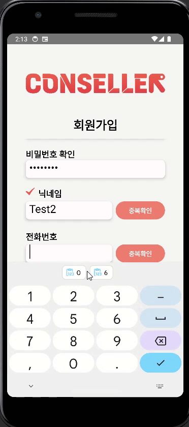
   

- 로그인

   
  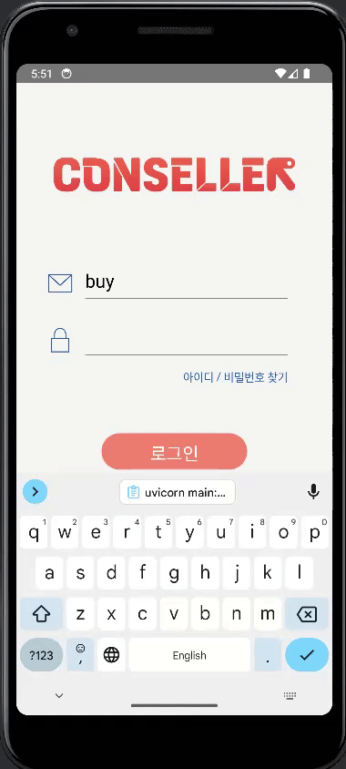
   

### 개인 정보 수정

   
  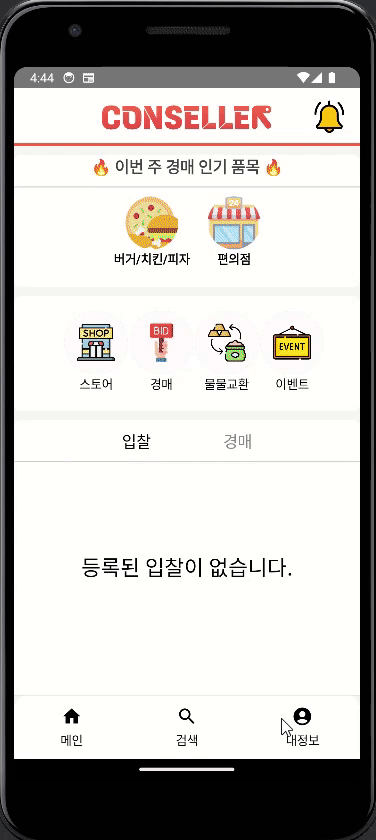
   

### 메인 페이지

   
  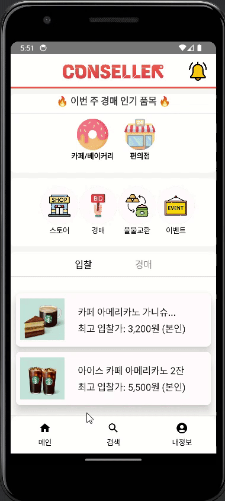
   

### 기프티콘 관리

- 기프티콘 등록

   
  
   

- 기프티콘 사용

   
  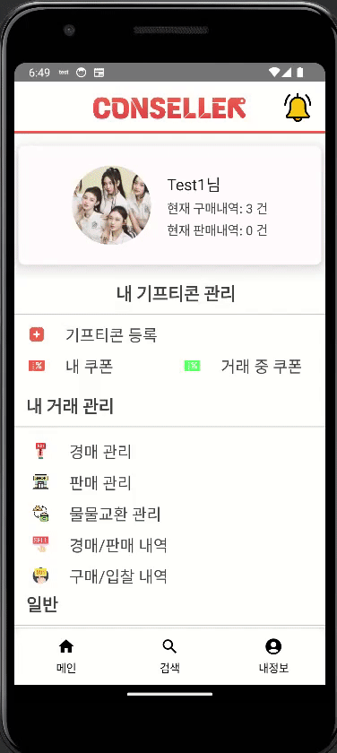
   

- 기프티콘 거래내역

   
  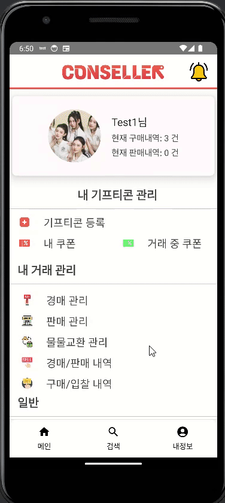
   

### 4. 기프티콘 판매

- 판매 등록

   
  
   

- 구매 입금 완료

   
  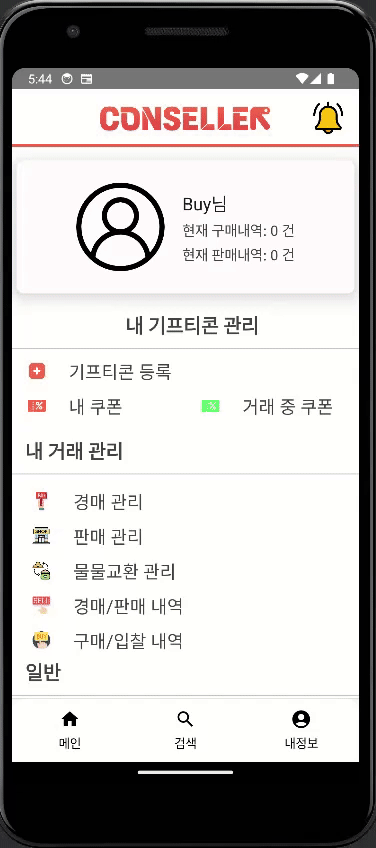
   

- 입금 확인

   
  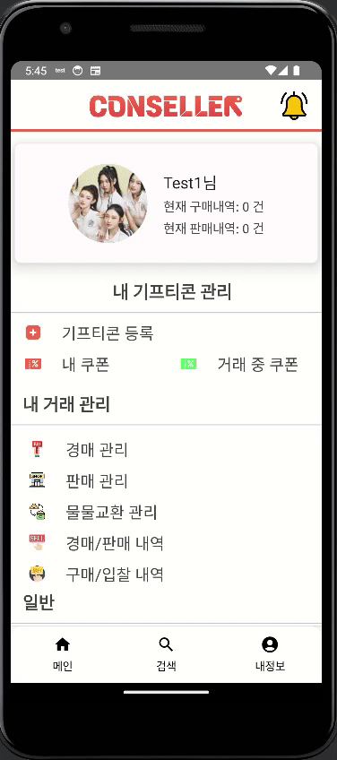
   

- 구매 완료

   
  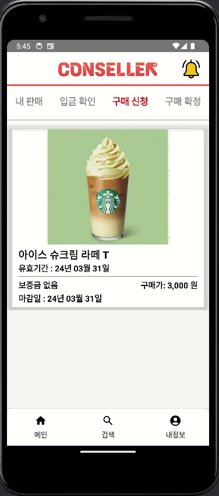
   

### 기프티콘 경매

- 경매 등록

   
  
   

- 입찰 등록

   
  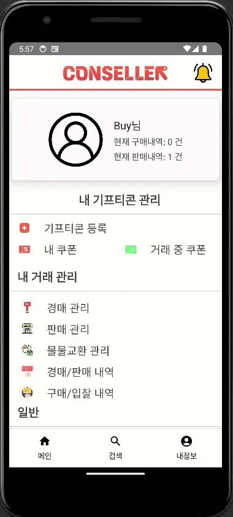
   

- 낙찰

   
  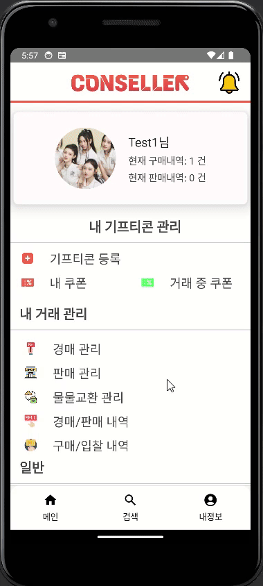
   

- 경매 입금 완료

   
  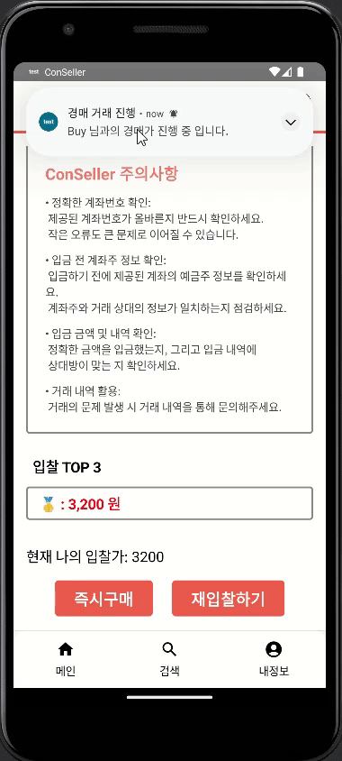
   

- 경매 완료

   
  
   

### 기프티콘 물물교환

- 물물교환 등록

   
  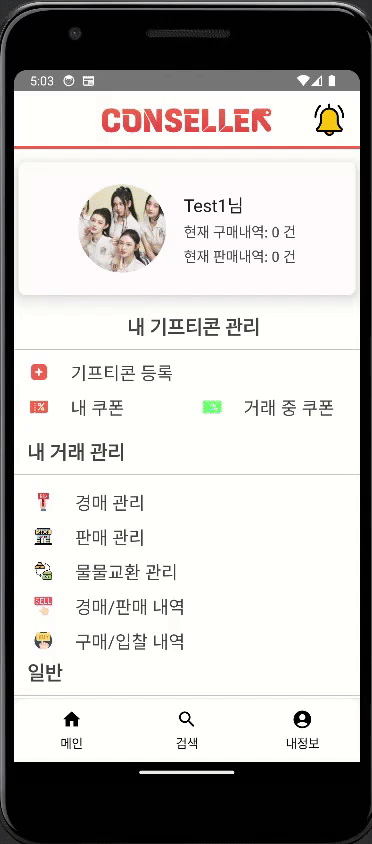
   

- 물물교환 신청

   
  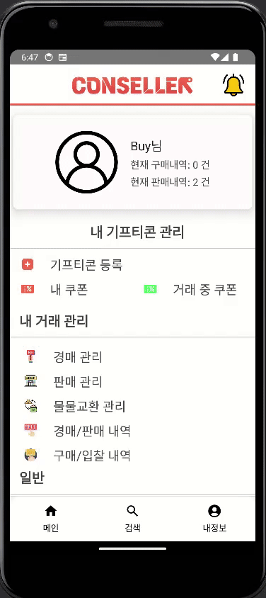
   

- 물물교환 완료

   
  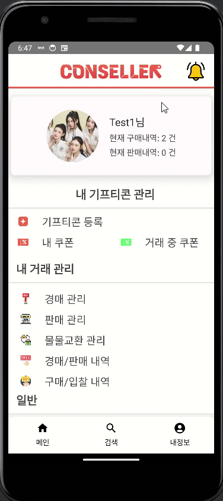
   

